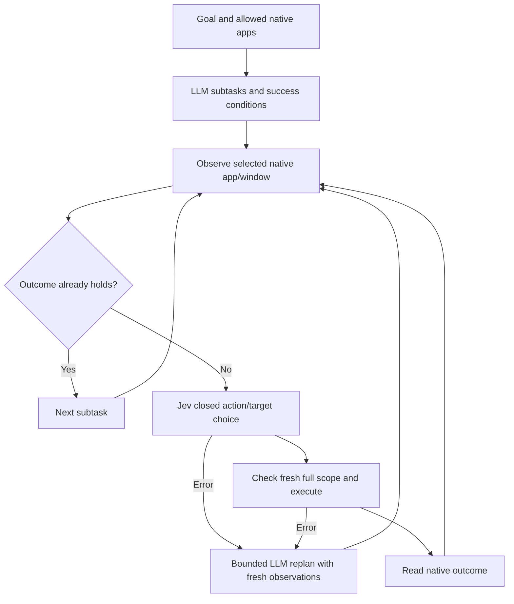

# P5: planning and native execution loop (2026-10-02)

Subsequent observation, recovery and checkpoint changes are documented in the [P5 follow-up](P5-FOLLOWUP.md). The results below retain the original acceptance run.

The first P5 implementation connects a JSON subtask planner, Jev and the native desktop runtime. It supports multiple explicitly allowed applications, observable success conditions, bounded recovery and pause/cancel/resume checkpoints. P5 remains a prototype; cross-platform acceptance depends on live macOS testing after unlock.

## Large-tree improvement

Exact names present in the goal now limit model context to observed candidates, their ancestors and small child subtrees. Duplicate names are kept together. If no names match, there are more than 32 matches, or the result exceeds 240 nodes, the full observation and hierarchical Choice path remain available.

Ancestor nodes supply context; their unrelated focus and click actions are excluded from the narrowed candidate set. Expansion remains available to reveal a path; explicitly requested scrolling and collapse retain ancestor actions. Text matching distinguishes Sample 50 from Sample 500 and supports Chinese text adjacent to English labels. Only short element tokens enter model context; code resolves them to observed refs.

The decision's digest still covers the complete original app/window snapshot. A change outside the model's narrowed context invalidates the old decision before execution. Native click uses an accessibility operation, so an observed off-viewport button can be invoked without pointer hit testing.

Three development runs matched 12/12 at 50/100/300/1,000 controls, compared with the earlier 9/12. Confidence remains 0.7. The final source run uses the smaller context format:

| Controls | Matched goals | Median API seconds | Median reported input tokens |
| --- | --- | --- | --- |
| 50 | 3/3 | 1.473 | 1,218 |
| 100 | 3/3 | 1.130 | 1,223 |
| 300 | 3/3 | 1.555 | 1,320 |
| 1,000 | 3/3 | 1.496 | 1,325 |

Evidence: [final run](evidence/2026-10-02-p5/scale-final.json), [first improved run](evidence/2026-10-02-p5/scale-bounded.json) and [repeat](evidence/2026-10-02-p5/scale-repeat.json). Earlier 300/1,000-control median input tokens were 21,740/18,253. Earlier API medians included rejected attempts, so they are not a successful-task latency baseline.

These are small development cases, not a general accuracy estimate. Three additional real Windows targets in a fresh 1,000-button fixture—137, 619 and 997—were invoked successfully and checked through a native status label. Evidence: [scale-live-final.json](evidence/2026-10-02-p5/scale-live-final.json). This checks actual execution, including offscreen controls, beyond saved-snapshot label matching.

## Planner and execution contract

The planner interface is replaceable. The first provider uses OpenRouter Chat Completions and `z-ai/glm-5.3-flash`, reused from the existing local Jev configuration. The endpoint and response format follow the [official Chat Completions API](https://openrouter.ai/docs/api/api-reference/chat/create-a-chat-completion) and [structured output documentation](https://openrouter.ai/docs/guides/features/structured-outputs).

Planner credentials are stored beside the private Jev config in `planner.json`, outside the repository. Fields are `api_key` and `model`; overrides are `OPENROUTER_API_KEY`, `BOKKIO_PLANNER_MODEL` and `BOKKIO_PLANNER_CONFIG`.

Each subtask contains:

- An ID, allowed application, optional observed window, and task intent.
- Allowed literal text values.
- One to four success conditions: exact role/name plus name, value, selected, expanded or focused.
- A risk category: read, local_write, external or destructive.

The schema excludes element refs, coordinates, concrete actions and shell commands. App/window pairs are bound in the output schema and checked in code. Early model outputs with numeric IDs, wrong app identifiers or mismatched windows were rejected before any action. Explicit app bindings and compact parent context improved subsequent planning.



Success comes from native observations. Model `done` cannot override a failed success condition. The verifier separately checks the user-requested outcomes so a generated plan cannot pass the test merely by choosing easier predicates.

The loop has an action budget of 1–100 dispatch attempts and a replan budget of 0–3. A stale attempt consumes budget. Repeated low confidence or lack of progress ends with `blocked`. Transport/configuration failures end with `failed`. External/destructive subtasks and recognized sensitive targets are blocked; this version has no approval bypass. Label-based target checks are a conservative guard, not a complete assessment of application semantics.

## Task control and traces

`bokkio run` returns a compact JSON status and the trace path. Blocked, failed and cancelled runs return exit code 1. Plan-only and paused runs return 0 with their explicit status.

The trace records planner observations/proposals, accepted plans, every Jev response, before/after snapshots, native actions, checks and errors. Updates replace the checkpoint atomically. POSIX files use mode 0600; Windows files inherit the selected folder's ACL. The trace contains native UI content, so use an appropriate output directory.

Control files contain `{"action":"pause"}` or `{"action":"cancel"}`. The loop checks before planning, at each observation and after a model call before dispatch. Pause saves a checkpoint. Resume uses the same goal/app allowlist, reobserves current state and generates a fresh decision. A pause before initial planning also resumes correctly. Cancellation during an in-flight native call takes effect at the next control check.

## Live tests and remaining acceptance

The final Windows run passed all three cross-app tasks. Each uses real OpenRouter planning, real Jev decisions and native UIA execution; independent native checks passed for both requested outcomes in every task.

| Task | Native application sequence | Dispatch attempts | Replans | Result |
| --- | --- | --- | --- | --- |
| 1 | Set Search and Submit → right-pane button in a second fixture | 3 | 0 | Passed |
| 2 | Select Second → replace text in a newly owned Notepad | 2 | 0 | Passed |
| 3 | Write Notepad → refresh dynamic controls in a second fixture | 3 | 0 | Passed |
| Stale-state recovery | Change Search after Jev returns → reject old decision → replan → write and submit | 3 | 1 | Passed |

The recovery run includes one rejected dispatch and two successful native actions. The saved-snapshot basic cases and live basic tasks also passed 5/5 each. Host and guest isolated regression suites passed 98 tests. Summaries and full traces are in [the evidence directory](evidence/2026-10-02-p5/README.md).

The planner now permits 8,000 output tokens because development runs with a 3,000-token budget produced incomplete plans. Responses whose finish reason is not `stop` remain rejected. The final three tasks required one planner call each, taking 38.422, 63.109 and 27.266 seconds. A socket timeout is not a whole-request deadline. Reported Jev costs total approximately $0.006983 for those three tasks; this excludes planner cost. These few fixture tasks establish the execution path, not broad reliability or production latency.

The owned Windows test applications are a WinForms interactions fixture, a second native hard-case fixture and a newly started Notepad. Tasks cover submit/status propagation, dropdown selection followed by document writing, and document writing followed by dynamic controls. A separate recovery test changes a native field after Jev responds, requiring the old decision to be rejected and the LLM to replan.

The macOS counterpart has two newly compiled Cocoa apps with Search, Submit and observable status labels. Three cross-app tasks and the existing horizontal/vertical scroll verifier are ready. The original preflight stopped on foreground `loginwindow`; that was an inference rather than an action-capability test. A subsequent owned-app probe confirmed `CGSSessionScreenIsLocked = 1` and `AXIsProcessTrusted() = true`. Direct system AX reads returned the application itself as its window and as a child, while Bokkio hit its 64-level traversal guard. Search/Submit were unavailable, so no native write or click was attempted. This establishes a current native-observation failure; a causal connection to screen lock still needs an unlocked comparison. Evidence: [session probe](evidence/2026-10-02-p5/macos/session-probe.json) and [native AX diagnostic](evidence/2026-10-02-p5/macos/native-session-diagnostic.log).

The verifier now launches owned fixtures and actually reads their Search/Submit controls before planning. Foreground `loginwindow` alone no longer blocks a run. A failed native preflight records the actual error and zero attempted tasks.

Remaining P5 acceptance:

- Run and verify the three macOS cross-app tasks and scrolling after unlock.
- Expand independent applications and task coverage, including browser compatibility through native accessibility.
- Evaluate repeated recovery, app restarts, selector changes and longer tasks.
- Measure loop/runtime latency with the subsequent bounded planner observations described in the follow-up.
- Expand sensitive-action policy beyond labels and planner risk tags before broader deployment.

## Commands

```bash
uv run bokkio run --goal 'Set Search to "hello" and submit it' \
  --allow-app BokkioWorkflowA --trace /tmp/bokkio-task.json --plan-only
uv run bokkio run --goal 'Set Search to "hello" and submit it' \
  --allow-app BokkioWorkflowA --trace /tmp/bokkio-task.json
```

Pause through a control file passed with `--control-file`. Clear that file's action or remove it before resuming with `--resume /tmp/bokkio-task.json`, keeping the same goal and app allowlist.

```bash
uv run python scripts/build_native_fixture.py --source fixtures/cocoa-workflow/main.swift \
  --name BokkioWorkflowA --output /tmp/BokkioWorkflowA.app
uv run python scripts/build_native_fixture.py --source fixtures/cocoa-workflow/main.swift \
  --name BokkioWorkflowB --output /tmp/BokkioWorkflowB.app
uv run python scripts/verify_p5_macos.py --output /tmp/bokkio-p5-macos
```
