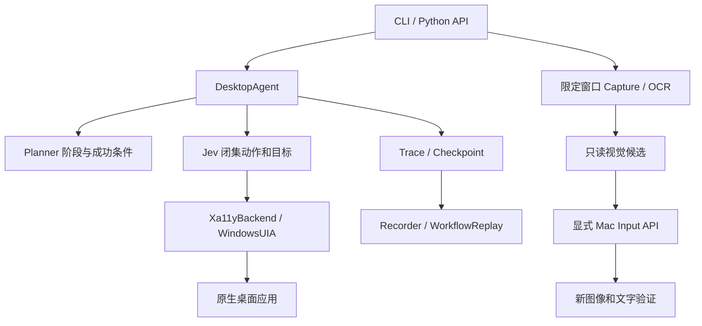

# 架构与代码导航

从入口到执行按模块职责阅读，比按提交时间浏览更容易定位改动。^[src/bokkio/cli.py#L12]

Capture/Candidate/Input 与 Agent 的自动降级连线尚未实现，图中不把它画成已运行的 Agent 路径。^[docs/STATUS.md#L5]

## 文件地图

| 模块 | 主文件 |
|---|---|
| 公共入口 | cli.py、pyproject.toml |
| 模型循环 | agent.py、planner.py、jev.py、decision.py |
| 元素与原生补充 | model.py、selector.py、xa11y_backend.py、windows_uia.py |
| 流程 | workflow.py、workflow_inputs.py、workflow_repair.py |
| 视觉 | windows_capture.py、macos_capture.py、native/macos_capture.swift、visual.py、visual_input.py |
| 评测 | arena.py、office_benchmark.py、office_runner.py、office_judge.py |

关联：[[entities/bokkio]]、[[entities/planner-and-jev]]、[[entities/workflow-engine]]、[[entities/capture-and-ocr]]、[[entities/benchmark-adapters]]。
